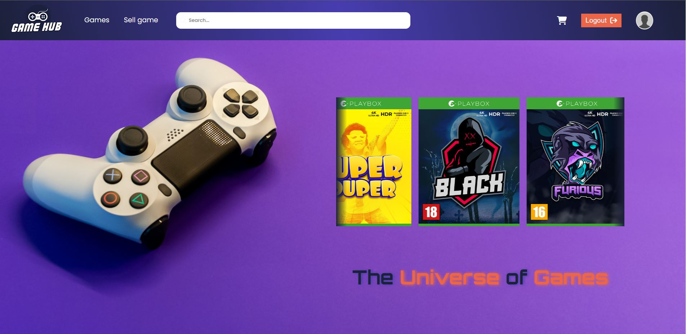
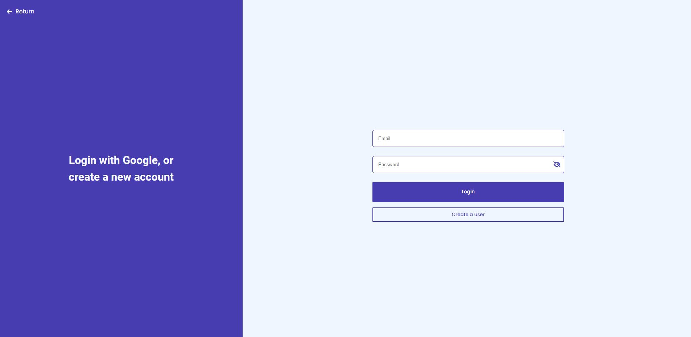
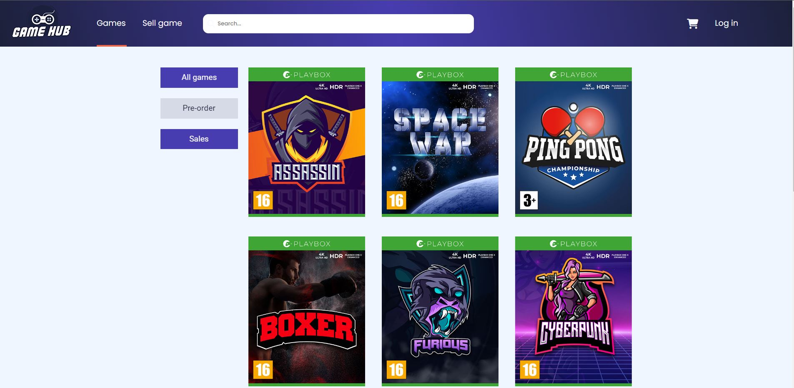

# Gamehub Remastered

> This project is mainly backend focused. It features user creation, log in functionality and CRUD operations by firebase database.
> Project is paused, because I want to implement stripe payments, but I need a VAT number, which I don't possess.
> Live demo [_here_](https://gorgeous-melomakarona-d5abd6.netlify.app/). <!-- If you have the project hosted somewhere, include the link here. -->

## Table of Contents

- [General Info](#general-information)
- [Technologies Used](#technologies-used)
- [Features](#features)
- [Screenshots](#screenshots)
- [Setup](#setup)
- [Usage](#usage)
- [Project Status](#project-status)
- [Room for Improvement](#room-for-improvement)
- [Contact](#contact)

## General Information

- Project shall showcase several video games fetched from database.
- Give the user the availability to create a user, and log in as that user.
- Add items to shopping cart.

## Technologies Used

- firebase: ^9.22.1,
- react: ^18.2.0,
- react-dom: ^18.2.0,
- sass: ^1.62.0

## Features

- Full CRUD functionality
- Login authentication
- Database storing

## Screenshots





## Setup

To start the project, open the console and type:
`npm install`
then
`npm run dev`
to start the dev server.

## Usage

1. First and foremost you need to create a new project in firebase, follow their setup to add a project. Once done, enter the console of the project, and select "Firestore database" and create a collection. You will be provided with a firebase config file which will be important.

2. Create a firebase.js file in the src directory and paste in the config code provided by firebase like so:

```jsx
// Import the functions you need from the SDKs you need
import { initializeApp } from "firebase/app";
import { getFirestore } from "firebase/firestore";
// TODO: Add SDKs for Firebase products that you want to use
// https://firebase.google.com/docs/web/setup#available-libraries

// Your web app's Firebase configuration
const firebaseConfig = {
  apiKey: "YOUR-DATA",
  authDomain: "YOUR-DATA",
  projectId: "YOUR-DATA",
  storageBucket: "YOUR-DATA",
  messagingSenderId: "YOUR-DATA",
  appId: "YOUR-DATA",
};

// Initialize Firebase
const app = initializeApp(firebaseConfig);
export const db = getFirestore(app);
export const auth = getAuth(app);
```

3. For CRUD functionality to work, you need to update the "games" string in all crud operations to whatever you've called your collection. If you have named your collection "games", no changes needs to be made

```jsx
const addGame = async (e) => {
  e.preventDefault();

  await addDoc(collection(db, "YOUR_COLLECTION_NAME"), {
    text: input,
    completed: false,
  });
};
```

## Project Status

Project is: _paused_ /

## Contact

Created by [@eivindsimonsen](https://www.linkedin.com/in/eivind-simonsen-9469121b9/) - feel free to contact me!
Visit my portfolio [here](https://www.easimonsen.com/)
